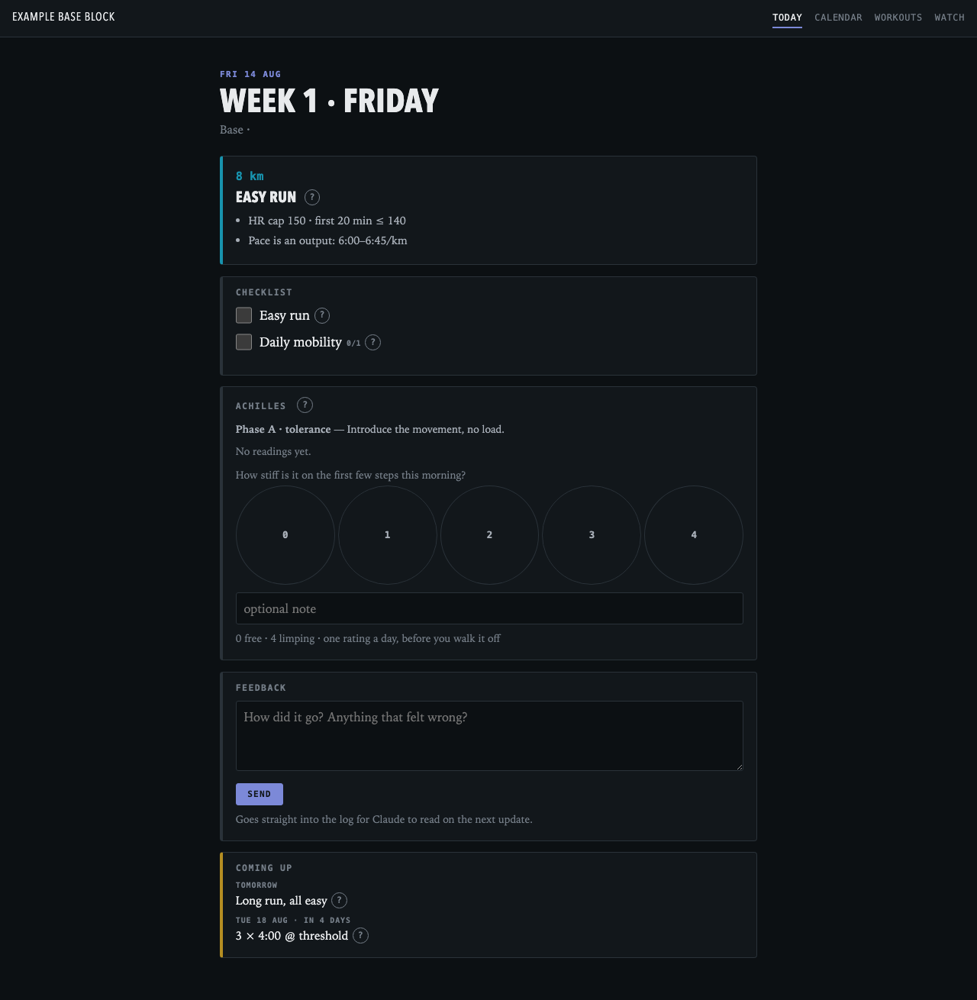
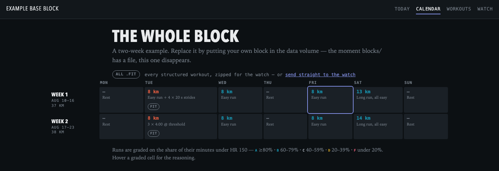
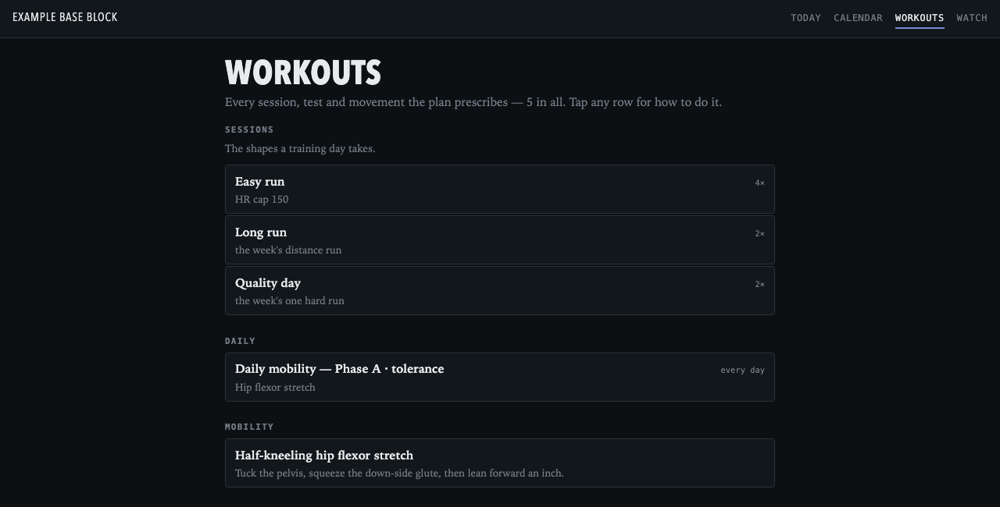
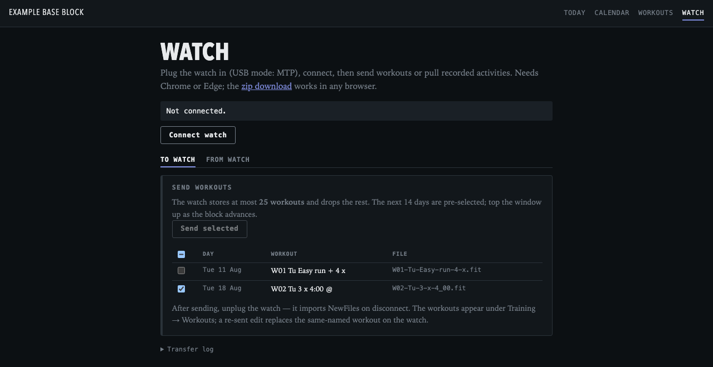

# Running Coach

A self-hosted dashboard for running a structured training plan. Write the
plan as JSON; the app turns it into a daily coaching view — plus two-way
Garmin watch sync straight from the browser.

## What it looks like

Today: the session, its targets, your checklist, and the injury check-in.



Calendar: the whole block, weekly volume, and grades as they land.



Workouts: everything the plan prescribes, each with a how-to guide.



Watch: send workouts to a Garmin watch and pull recorded activities back.
Works in Chrome/Edge over USB — no vendor software.



## Features

- **Plan as data** — an athlete file (units, timezone, HR/power/pace
  anchors) plus one JSON file per training block. Change an anchor and
  every derived number in the app updates.
- **Daily log** — checkoffs, injury ratings, free-text feedback, and
  per-session grades on the calendar.
- **Injury tracking** — declare an issue with a rating scale and
  green/amber/red bands; the app asks daily and tells you what to do at
  each level.
- **Watch sync** — structured workouts export as Garmin FIT files (and
  Zwift `.zwo` for trainer rides); recorded activities pull back into an
  archive on your server. `tools/fit_streams.py` converts an activity for
  analysis.
- **Small and self-contained** — one Go binary (standard library only),
  ~18 MB image. The plan lives on a mounted volume, so plan edits go live
  with a file copy and a reload — no rebuild.

## Run it

```sh
cd app
make run     # http://localhost:8080 — serves the built-in example athlete
make test
```

The example athlete under `app/defaults/` (a two-week block, shown in the
screenshots) serves until you put your own plan in `app/data/`.

## Docker

```sh
cd app
docker build --build-arg SRC_HASH=$(git rev-parse --short HEAD) -t running-coach .
docker run -d -p 8080:8080 -v "$PWD/data:/data" running-coach
```

An empty `/data` volume serves the example athlete; your files serve your
plan. `compose.yml` has the full running configuration.

## Access

The app has no authentication of its own. Anything that can reach the
port gets every page and every API: the plan, the daily log, and the
archived activity files, GPS and all. Put it behind something that
authenticates — an identity-aware proxy, a zero-trust tunnel, or a
network only you are on.

## Your own plan

1. `AUTHORING.md` documents every field. Or let an LLM interview you:
   `tools/new-athlete.md` ends in a validated athlete file and first block.
2. Put the files in `app/data/`, then `make validate` and `make run`.
3. For a server: put host/ssh coordinates in `app/local.mk`, then
   `make deploy` — builds for arm64, ships over ssh, restarts, and
   verifies the live site serves this build and this plan.
